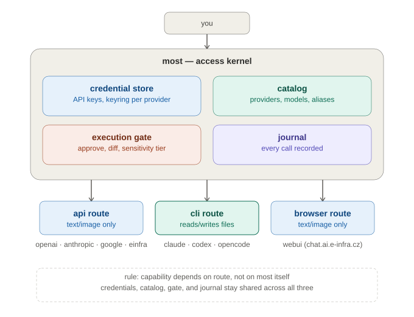
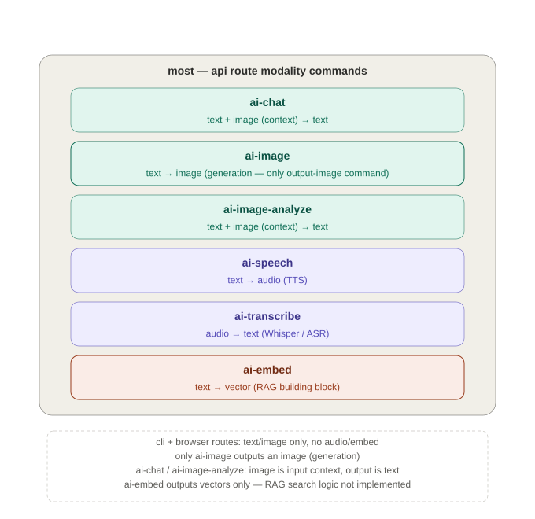

# most

Python file-based safety kernel for the multi-provider AI access application.

See the [practical usage manual](examples/basic-usage.md) for copy-paste
examples covering text, embeddings, images, speech, and model selection.

## Installation

For complete Linux, Windows, and macOS setup—including provider logins,
Ollama models, CERIT API keys, browser support, and verification—see
[install.md](install.md).

## Development

```bash
uv sync --extra dev
uv run pytest
uv run ruff check most tests
```

Basic commands:

```bash
uv run python -m most --data-root ./application-data create-session "Research"
uv run python -m most --data-root ./application-data create-configuration "Local Ollama" --provider local/Ollama
uv run python -m most --data-root ./application-data list-sessions
uv run python -m most --data-root ./application-data list-configurations
uv run python -m most --data-root ./application-data inspect-execution <execution-id>
uv run python -m most --data-root ./application-data history --pipeline-id <pipeline-id> --json
uv run python -m most --data-root ./application-data inspect-workspace <repository> --diff
uv run python -m most --data-root ./application-data inspect-workspace <repository> --diff --diff-against HEAD
uv run python -m most --data-root ./application-data inspect-workspace <repository> --compatibility
uv run python -m most --data-root ./application-data chat --model granite4.1:3b
```

For a file-mutating Claude Code stage, opt in explicitly to edits and point
MOST at the target repository:

```bash
uv run python -m most cli-chat --agent claude --writable \
  --workspace /path/to/repository --profile coding \
  --pipeline-id pipeline-123 --stage-index 1 "Implement the requested change"
```

Without `--workspace`, CLI sessions use a MOST-managed sandbox. The
`inspect-workspace --diff` uses Git's default index-relative diff: unstaged
working-tree changes are reported, while staged changes are not. Pass
`--diff-against HEAD` (or another commit/ref) for a ref-relative diff. The
result is not an invocation-scoped snapshot. For a per-pipeline stage diff,
use a clean/dedicated workspace or capture the baseline commit before invoking
the stage and pass that baseline with `--diff-against`.

During an interactive `cli-chat` session, use `/rewind` or `/rewind N` to
remove the last one or N complete user/assistant exchanges from the active
provider context. MOST keeps the original journal records and writes a
`conversation_rewind` event; the rewind changes only what is sent on the next
request. This context rewind does not undo file changes, so use the workspace
Git baseline for code rollback.

For machine-driven stages, `cli-chat`, `ai-chat`, and `cerit-chat` accept
`--json` and emit one JSON object containing `content`, `session_id`,
`profile`, `pipeline_id`, `stage_index`, and `operation_id`. Human-readable
framing is disabled in this mode so integrations do not need to scrape stdout.

See [ai-map.md](ai-map.md) for the quick provider map and
[the detailed AI provider guide](docs/ai-provider-guide.md) for official links,
e-INFRA model aliases, MCP servers, local models, and pricing guidance.

Current interface scope is the command-line application, provider CLI
wrappers, APIs, and MOST-managed browser sessions. MOST does not passively
capture conversations from an already-open desktop app or ordinary browser
tab; use an explicit MOST route or manual relay when a conversation must be
journaled.



The architecture diagram shows the shared credential store, catalog,
execution gate, and journal behind the API, CLI, and browser routes. The
[route capability map](docs/assets/diagrams/routes-capability-map.svg) gives
the compact comparison of those routes.

The versioned [AI provider catalog](ai-catalog.yaml) is the structured source
for provider routes, model aliases, availability, pricing metadata, and the
official pages used to refresh it. Exact cloud prices and live e-INFRA model
availability should be refreshed before cost-sensitive or reproducibility-
sensitive work.

`ai-catalog.yaml` is the stable curated baseline. `ai-discovered.yaml` is a
generated snapshot of dynamic provider models and should be refreshed regularly;
it is not the place for manually maintained pricing.

Downstream integrations can query maintained aliases and MCP server names
without loading credentials or contacting a provider:

```bash
uv run python -m most list-aliases --provider einfra
uv run python -m most list-mcp-servers
```

Both commands return JSON from MOST's catalog and CLI MCP registry, so clients
such as Tandem do not need to duplicate provider aliases or tool URLs.

The live provider test is opt-in. Test all configured providers and fail if a
provider is unavailable or missing credentials:

```bash
MOST_RUN_PROVIDER_INTEGRATION=1 uv run pytest tests/test_all_providers.py
```

Test one installed provider instead:

```bash
MOST_RUN_PROVIDER_INTEGRATION=1 MOST_PROVIDER=claude \
  uv run pytest tests/test_all_providers.py
```

For a simple live API smoke test across the configured chat providers, run:

```bash
./scripts/smoke-test-ai.sh
```

This sends one short request to Ollama, e-INFRA, OpenAI, Anthropic, and Google.
Override a model with variables such as `MOST_OPENAI_MODEL` or change the
prompt with `MOST_SMOKE_PROMPT`. API routes may incur usage charges; browser
and subscription CLI routes are tested separately.

Audit the catalog routes and model discovery endpoints from the current
machine. Missing credentials are reported as `unknown`; they are not treated
as provider failures. Localhost and private-network OpenAI-compatible
endpoints may be audited without an API key. Add `--update` only when you want
confirmed model statuses written back to `ai-catalog.yaml`:

```bash
uv run python -m most catalog-audit
uv run python -m most catalog-audit --update
```

The normal update keeps the catalog curated. To import every discovered API
model, use the explicit sync option:

```bash
uv run python -m most catalog-audit \
  --update --sync-models
```

Synced models receive availability and capability metadata, but pricing remains
`unknown` until a reviewed pricing update is applied.

For routine use, `catalog-audit` automatically writes dynamic discovery to
`ai-discovered.yaml`. This keeps rotating provider models separate from the
stable curated catalog while making them available to selection and display
tooling. Use `--no-discovered` to disable the generated snapshot.

The shorter refresh command is equivalent for daily use:

```bash
uv run python -m most catalog-refresh --show-models
```

When a unified API chat request fails, MOST records the failure in
`application-data/provider-health.yaml`, rechecks the provider inventory, and
prints replacement candidates without silently changing models. Recheck all
recorded failures manually with:

```bash
uv run python -m most catalog-health
```

This health check uses provider model discovery; it does not send an extra chat
probe or incur an additional model request.

It refreshes route/model availability and writes `ai-discovered.yaml`. The
snapshot includes conservative task hints such as `coding`, `reasoning`,
`semantic-search`, and `transcription`; these are heuristics, not benchmark
claims. Pricing remains a separate reviewed update.

To inspect exact e-INFRA model names, ranked with reasoning/pro variants and
newer-looking model versions first:

```bash
uv run python -m most catalog-audit --provider einfra --show-models
```

The ranking is only for readability; the provider’s live metadata remains the
source of truth for actual availability and model quality.

For a daily Linux refresh, run the command from the repository directory using
a service environment that securely provides API credentials:

```cron
0 3 * * * cd /home/sysox/Projects/most && /usr/bin/uv run python -m most catalog-refresh
```

Pricing is refreshed separately and only from reviewed provider sources. The
checked-in [pricing-update.yaml](pricing-update.yaml) is the current example
snapshot; validate it before applying future changes.

Pricing is maintained separately from availability. Create a reviewed update
file using this format:

```yaml
prices:
  - provider_id: openai
    model_id: gpt-5.6-sol
    per_1m_tokens:
      input: 5
      output: 30
      cached_input: 0.5
    source:
      url: https://developers.openai.com/api/docs/pricing
      checked_at: 2026-08-04
```

Validate first, then explicitly write the update:

```bash
uv run python -m most catalog-pricing --source pricing-update.yaml
uv run python -m most catalog-pricing --source pricing-update.yaml --update
```

Prices must have an HTTPS source and review date. Unknown pricing remains
`unknown`; local providers are zero-cost and institutional services do not
claim a per-token user price.

OpenAI GPT is available through the official Responses API. Set the key only in
the process environment; it is not written to MOST configuration or payloads:

```bash
read -rsp "OpenAI API key: " OPENAI_API_KEY; export OPENAI_API_KEY; echo
uv run python -m most --data-root ./application-data gpt-chat \
  --model gpt-5.6 "Hello from MOST"
```

Use `--api-key-env` to select a different environment variable and `--base-url`
for a compatible gateway. The default endpoint is `https://api.openai.com/v1`.

API keys can also be stored in the native OS credential store through the
unified keyring backend:

```bash
uv run python -m most credentials set openai
uv run python -m most credentials set einfra
uv run python -m most credentials list
```

If a key is already exported, copy it without displaying it:

```bash
uv run python -m most credentials set openai --from-env
```

MOST uses environment variables first and the keyring second. `keyring` maps to
Secret Service on Linux, Keychain on macOS, and Credential Locker on Windows.
Remove a stored key with `most credentials remove <provider>`.

The unified API chat supports OpenAI, CERIT/e-INFRA, Anthropic, and Gemini:

```bash
uv run python -m most ai-chat --provider anthropic --model claude-sonnet-5 --route api "Hello"
uv run python -m most ai-chat --provider google --model gemini-3.5-flash --route api "Hello"
```

Use `--route cli` for subscription-backed local clients such as `claude` or
`agy`. Use `catalog-audit --show-models` to refresh the live model inventory.

Gemini for Education is recorded as a Google account profile rather than as a
separate API model. It requires an institution-managed Google Workspace for
Education account and is used through the Gemini web app or browser route:

```bash
uv run python -m most --data-root ./application-data browser-chat gemini
```

Google documents Education core-service protections including no human review
and no use of data to train models. Confirm the applicable Workspace edition
and administrator settings before sending institutional or student data.

Filter the catalog by modality:

```bash
uv run python -m most catalog-options --capability chat
uv run python -m most catalog-options --capability embedding
uv run python -m most catalog-options --capability image
uv run python -m most catalog-options --capability speech
uv run python -m most catalog-options --capability transcription
```

`catalog-options` displays explicit `input` and `output` columns. For example,
an embedding model is `text -> embedding`, a Whisper model is `audio -> text`,
and an image generator is `text -> image`.



This modality diagram distinguishes image input for analysis from image output
for generation; only the generation command produces an image file.

`ai-chat` requires the selected model to advertise the `chat` capability, so
embedding, image, and speech models cannot be sent accidentally to a text-chat
route.

Capability-specific operations are available through the same catalog and
keyring. Embeddings and image analysis also work through OpenAI-compatible
providers such as e-INFRA:

```bash
uv run python -m most ai-embed --model models/gemini-embedding-001 --input document.txt --output document.embedding.json
uv run python -m most ai-image --model models/gemini-3-pro-image-preview --output picture.bin "Create a mountain illustration"
uv run python -m most ai-speech --model models/gemini-2.5-pro-preview-tts --output speech.bin "Read this sentence aloud"
uv run python -m most ai-image-analyze --model gemini-3.5-flash --input picture.png "Describe this image"
uv run python -m most ai-embed --provider einfra --model qwen3-embedding-4b --input document.txt
uv run python -m most ai-image-analyze --provider einfra --model kimi --input picture.png "Describe this image"
```

Image generation and speech synthesis currently target the Google Gemini API;
e-INFRA has no verified standalone API for these operations. The catalog
validates the required capability before sending a request, and MOST rejects
unverified provider/operation combinations before network access.

Audio transcription uses an audio-to-text model such as OpenAI Whisper:

```bash
uv run python -m most ai-transcribe \
  --provider openai --model whisper-1 \
  --input examples/media/sample-speech.wav
```

The transcript is printed to the terminal and recorded in the session journal.
Use `catalog-options --capability transcription` to find other configured
audio-to-text models. The selected model must advertise `audio` input and
`text` output; MOST rejects incompatible models before transmission.

The live test uses already authenticated local CLIs for Claude, Codex, Gemini,
and Antigravity. e-INFRA uses its OpenAI-compatible API route and therefore
requires `CERIT_API_KEY`; Ollama uses its local endpoint and needs no key.

The `chat` command uses the local OpenAI-compatible endpoint at
`http://127.0.0.1:11434/v1` by default, so it works with Ollama without an API
key. The same adapter pattern can be used for a local vLLM, LM Studio, or
other OpenAI-compatible proxy when its endpoint and model are represented in
`ai-catalog.yaml`; credentials are optional for local endpoints. Pass one
prompt for a single turn or omit the prompt for an interactive session:

```bash
uv run python -m most --data-root ./application-data chat --model granite4.1:3b "Hello"
uv run python -m most --data-root ./application-data chat --model ministral-3:8b
```

CERIT-SC/e-INFRA CZ provides an OpenAI-compatible on-premise endpoint at
`https://llm.ai.e-infra.cz/v1`. Create an API key in the CERIT Open WebUI,
then provide it through the environment; MOST does not persist the key:

```bash
read -rsp "CERIT API key: " CERIT_API_KEY; export CERIT_API_KEY; echo
uv run python -m most --data-root ./application-data cerit-chat \
  --model mini "Hello from MOST"
```

Use maintained CERIT aliases such as `mini`, `coder`, `agentic`, `kimi`,
`glm`, or `deepseek`; exact model names may change. The request and response
are recorded in MOST's local journal. Access requires an active MetaCentrum
or eligible Masaryk University account. See the
[CERIT API documentation](https://docs.cerit.io/en/docs/ai-as-a-service/ai-api).

Browser communication is optional and uses Firefox with an isolated profile:

```bash
uv sync --extra browser
uv run python -m most --data-root ./application-data browser-chat gemini
uv run python -m most --data-root ./application-data browser-chat chatgpt
uv run python -m most --data-root ./application-data browser-chat claude
uv run python -m most --data-root ./application-data browser-chat cerit --manual
```

If a provider blocks WebDriver sign-in, use manual browser relay mode. MOST
opens the normal browser, and you copy the prompt and response yourself:

```bash
uv run python -m most --data-root ./application-data browser-chat gemini --manual
```

This mode does not inspect cookies, automate login, bypass CAPTCHA, or evade
provider security controls. It records the manually mediated exchange in the
MOST journal.

Browser routes are not permitted for sensitive workloads. Mark a session
explicitly when needed; MOST will fail before opening or sending content:

```bash
uv run python -m most browser-chat gemini --sensitivity-tier sensitive
```

API and multimodal routes can also select a workload tier. For sensitive
e-INFRA work, the selected catalog model must explicitly be marked
`is_external_passthrough: false`; unknown or externally routed models are
rejected before the provider request:

```bash
uv run python -m most ai-chat --provider einfra --model mini \
  --sensitivity-tier sensitive "Summarize the local report"
uv run python -m most ai-embed --provider einfra --model qwen3-embedding-4b \
  --sensitivity-tier sensitive --input report.txt
```

Use separate named profiles when you have more than one account, for example
personal Gemini and Gemini for Education. Each profile keeps its own login:

```bash
uv run python -m most browser-chat gemini --profile gemini-personal
uv run python -m most browser-chat gemini --profile gemini-edu
```

Installed subscription-backed CLI clients can be used directly from the
terminal. MOST runs them in an application-managed sandbox and records their
observable command/output history:

```bash
uv run python -m most --data-root ./application-data cli-chat codex --allow-unknown-connectivity
uv run python -m most --data-root ./application-data cli-chat claude --allow-unknown-connectivity
uv run python -m most --data-root ./application-data cli-chat agy --allow-unknown-connectivity
uv run python -m most --data-root ./application-data cli-chat opencode --allow-unknown-connectivity
```

For e-INFRA Claude sessions, MOST can attach MCP servers without modifying
the user's persistent Claude configuration:

```bash
uv run python -m most cli-chat claude --credential-provider einfra \
  --mcp-server DocFork --mcp-server npmjs
```

`ddg_search` is included automatically for e-INFRA Claude sessions. Attach
only the servers needed for the task because each one consumes context.

Codex runs with an ephemeral, read-only, non-repository execution. The
provider CLI itself handles subscription authentication; MOST never receives
or stores the provider login token.

For an explicit Codex write-capable session, use `--writable`. This enables
Codex `workspace-write` only inside MOST's managed CLI sandbox; it does not
grant access to the original repository automatically:

```bash
uv run python -m most cli-chat codex --writable --allow-unknown-connectivity
```

`agy` is the Antigravity CLI replacement for the retired Gemini individual
sign-in flow. It runs with its own sandbox flag and uses the Google account
authentication established by Antigravity. Authenticate with `agy` once before
using it through MOST. If headless mode reports that a command permission is
required, open `/permissions` in an interactive `agy --sandbox` session and
add only the specific read-only command requested by Antigravity. Do not use
`--dangerously-skip-permissions` as a general solution.

For Snap-packaged Firefox on Linux, use a visible profile root if Firefox
cannot access the default hidden application-data path:

```bash
export MOST_BROWSER_PROFILE_ROOT="$HOME/most-browser-profiles"
mkdir -p "$MOST_BROWSER_PROFILE_ROOT"
```

The command opens the provider site, pauses for manual login, and then records
the conversation and execution in the same file-backed journal. It does not
bypass login, CAPTCHA, consent, rate limits, or other site controls.

The current implementation provides unified CLI and API chat, embeddings,
image generation and analysis, speech synthesis, transcription, dynamic model
catalog discovery, pricing updates, provider-health checks, exposure-policy
evaluation, and file-backed execution/result journaling. Local, official-cloud,
OpenAI-compatible, provider-CLI, and manually authenticated browser routes use
the same execution gate. Browser conversations remain opt-in and explicit;
MOST does not passively capture activity from provider applications or websites.
Benchmark-based model recommendations and full submodule/LFS/path-limit
mutation fallbacks remain future work.
